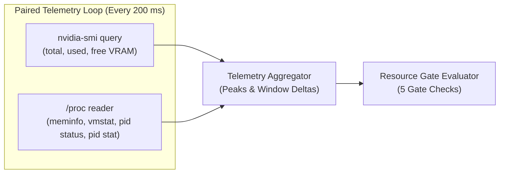

# LTX-2.5 Hardware Certification Runbook & Metric Semantics

This document describes the operational procedures, metric semantics, CLI usage, hardware requirements, and acceptance criteria for certifying the pinned Gold Master LTX-2.5 workload on the Trinidad NVIDIA GeForce RTX 4090 render host.

---

## 1. Prerequisites & Target Environment

Hardware certification verifies the empirical resource envelope of the LTX-2.5 video generation pipeline. Certification must be performed directly on the target hardware under controlled conditions.

### Target Hardware & Host Requirements
- **Host Platform:** Linux x86_64 (Linux kernel `/proc` filesystem required for host telemetry).
- **GPU:** Dedicated NVIDIA GeForce RTX 4090 (24 GB VRAM).
- **GPU Driver & Tools:** Official NVIDIA proprietary driver with CUDA support and `nvidia-smi` available in `$PATH`.
- **Runtime:** Node.js 24 LTS (`Krypton`) and `pnpm` 9.x.
- **ComfyUI Service:** Running ComfyUI instance accessible over HTTP/WebSocket, with its OS process ID (`PID`) known to the operator.
- **Disk Storage:** At least **100 GB** of verified free disk space reservation on the filesystem hosting ComfyUI models and outputs (`minFreeDiskGb: 100`).
- **Approved Gold Master Report:** An approved, host-validated Gold Master provenance JSON report generated from the running Trinidad host (`source.kind = "validated_host_export"` with an immutable Git commit revision and exact workflow/model SHA-256 hashes).

---

## 2. Certification CLI Invocation

The certification harness is executed via the `certify` script (or alias `certify:ltx` / `certify:flux`) in `@cco/render-worker`:

```bash
pnpm certify:ltx \
  --comfyui-dir /path/to/ComfyUI \
  --comfyui-url http://127.0.0.1:8188 \
  --comfyui-pid <PID> \
  --gold-master-provenance /path/to/approved-ltx-provenance.json \
  --run-id ltx-cert-run-001
```

### CLI Flag Reference

| Flag | Required | Default | Description |
|---|---|---|---|
| `--comfyui-dir <path>` | **Yes** | — | Path to the ComfyUI installation directory. |
| `--comfyui-url <url>` | **Yes** | — | ComfyUI HTTP/WebSocket base URL (e.g. `http://127.0.0.1:8188`). |
| `--comfyui-pid <pid>` | **Yes** | — | Process ID (PID) of the running ComfyUI process (positive integer). |
| `--gold-master-provenance <path>` | **Yes** | — | Path to approved Gold Master provenance JSON report. |
| `--profile <profile-id>` | No | `ltx-25-720p-97f` | Profile identifier to certify (`ltx-25-720p-97f` or `flux-schnell-draft`). |
| `--run-id <id>` | **Yes** | — | Unique run identifier matching `^[a-z0-9][a-z0-9._-]*$`. |
| `--manifest <path>` | No | `templates/provenance.json` | Path to certification profile manifest JSON. |
| `--gpu-index <index>` | No | `0` | Zero-based NVIDIA GPU device index. |
| `--output-root <path>` | No | `certification/ltx-25` | Destination directory for certification evidence artifacts. |
| `--highvram` | No | `false` | Enable HighVRAM comparator mode (default is DynamicVRAM). |
| `--help`, `-h` | No | — | Display CLI usage information and exit. |

### Exit Codes

| Exit Code | Classification | Meaning |
|---|---|---|
| `0` | **Success** | All preflight checks passed, render completed without OOM in $\le 55$ s, all telemetry samples and post-unload settle measurements were recorded, all 5 gate checks passed, and artifacts were written. |
| `1` | **Failure** | Certification failed. Triggers include: preflight hash mismatch, unpinned provenance, disk reservation $< 100$ GB, memory mode conflict, ComfyUI render error, OOM, total duration $> 55$ s, telemetry sampling error, counter reset, or filesystem write failure. |
| `77` | **Unsupported Hardware** | Execution environment lacks required hardware (e.g., non-Linux OS, `nvidia-smi` missing/unreachable, non-RTX 4090 GPU, VRAM $< 24$ GB). This allows generic CI environments to intentionally skip live hardware certification without reporting a false test failure. |

---

## 3. Output Layout & Video Media Rule

Upon completion of a certification run, evidence artifacts are written atomically into a dedicated run directory:

```text
certification/ltx-25/<run-id>/
├── result.json   # Machine-readable JSON artifact (validated against LtxCertificationArtifactSchema)
└── summary.md   # Human-readable Markdown summary report
```

### Video Media Storage Rule
- Large rendered video outputs (e.g., `.mp4`, `.webm`) **remain external** on the render host or object storage.
- The certification artifact records output object keys, file paths, and hashes under `render.outputs`.
- **Large video binary files must never be committed to Git.**

---

## 4. Metric Semantics & Mathematical Derivations

The harness collects synchronized telemetry every **200 ms** across both GPU and host systems. Metrics are aggregated into peak and delta values following rigorous mathematical definitions:



### Metric Definitions

| Metric | Source | Unit & Derivation | Semantics |
|---|---|---|---|
| **Sampling Interval** | `TelemetrySampler` | `200 ms` | Fixed sampling loop interval polling GPU and host adapters concurrently. |
| **GPU VRAM (Total/Used/Free)** | `nvidia-smi --query-gpu=memory.total,memory.used,memory.free --format=csv,noheader,nounits` | `MB` | Exact integer values reported by NVIDIA driver without units. |
| **Driver-Reserved VRAM (`reservedVramMb`)** | GPU Telemetry Series | `MB` | `totalVramMb - (usedVramMb + freeVramMb)`. Constant driver/VBIOS reservation. |
| **Allocatable VRAM Denominator** | GPU Telemetry Series | `MB` | `totalVramMb - reservedVramMb` (or `usedVramMb + freeVramMb`). The true denominator for headroom and utilisation. |
| **Peak VRAM** | GPU Telemetry Series | `MB` | Maximum `usedVramMb` observed across all samples in the run. |
| **Host RAM (Total/Avail/Used)** | `/proc/meminfo` | `MB` | `hostRamTotalMb = round(MemTotal_kB / 1024)`<br>`hostRamAvailableMb = round(MemAvailable_kB / 1024)`<br>`hostRamUsedMb = hostRamTotalMb - hostRamAvailableMb` |
| **Peak Host Used RAM** | Host Telemetry Series | `MB` | Maximum `hostRamUsedMb` (`MemTotal - MemAvailable`) observed across all samples. |
| **Process RSS (`processRssMb`)** | `/proc/<pid>/status` (`VmRSS`) | `MB` | `round(VmRSS_kB / 1024)`. Resident memory bound strictly to ComfyUI's PID. |
| **Peak Process RSS** | Host Telemetry Series | `MB` | Maximum `processRssMb` observed across all samples in the run. |
| **Swap Used Delta** | `/proc/meminfo` | `MB` | `swapUsedMb(last_sample) - swapUsedMb(first_sample)`. |
| **System Page Fault Deltas** | `/proc/vmstat` | Pages / Faults | `last_sample - first_sample` for `pgmajfault` (major) and `pgfault` (minor). |
| **System Swap Page Deltas** | `/proc/vmstat` | Pages | `last_sample - first_sample` for `pswpin` (swap in) and `pswpout` (swap out). |
| **Process Page Fault Deltas** | `/proc/<pid>/stat` | Faults | `last_sample - first_sample` for field 12 (`majflt`) and field 10 (`minflt`). |
| **Post-Unload VRAM & Headroom** | Explicit Post-Unload Sample | `MB` | GPU memory snapshot taken after invoking `/free` (`unloadModels()`) and waiting for a fixed **5-second settle period** (`settleDurationMs = 5000`). |

---

## 5. Telemetry Integrity & Operating Assumptions

### Idle Host Assumption for System Deltas
System-wide metrics (`hostRamUsedMb`, `swapUsedDeltaMb`, `systemMajorPageFaultDelta`, `systemSwapInPageDelta`) measure global kernel counters. The harness assumes the render workstation is **otherwise idle** during certification. Background processes will introduce noise into system deltas.

### PID & Process Identity Binding
Process metrics (`processRssMb`, `processMajorPageFaultDelta`, `processMinorPageFaultDelta`) are strictly bound to ComfyUI's PID and process start time:
- The adapter reads `/proc/<pid>/stat` field 22 (`starttime` in jiffies/ticks) on the initial sample.
- Every subsequent sample asserts that `starttime` matches the initial value.
- If ComfyUI crashes, restarts, or the PID is recycled by the kernel, PID reuse is immediately detected and the adapter throws `LinuxHostTelemetryError`.

### Fail-Closed Counter Reset & Error Handling
- All delta calculations require non-negative results: $\text{delta} = \text{last} - \text{first} \ge 0$.
- If a counter resets or decreases ($\text{delta} < 0$), or if any single telemetry sample fails to read or parse, the aggregate metric evaluates to `null`.
- When any aggregate metric is `null` or sampling errors occur, `telemetryComplete` evaluates to `false`.
- The run immediately fails with exit code `1`. **No metric is ever defaulted to zero or fabricated.**

---

## 6. Memory Profile Baseline & Comparator Path

### Default Production Baseline: DynamicVRAM
The certified production baseline is **ComfyUI DynamicVRAM / workflow-managed offloading** (`dynamicvram-offload-v1`):
- ComfyUI dynamically manages model weights between host system RAM and GPU VRAM during generation phases.
- ComfyUI process arguments must **not** contain explicit VRAM flags (`--highvram`, `--gpu-only`, `--lowvram`, `--novram`, `--normalvram`, `--cpu`).

### Comparator Mode: HighVRAM
An optional comparator path evaluates `--highvram`:
- ComfyUI is launched with `--highvram` (keeping all model weights resident in VRAM).
- Execute the certification harness with the `--highvram` flag and a **distinct run ID**:

```bash
pnpm certify:ltx \
  --comfyui-dir /path/to/ComfyUI \
  --comfyui-url http://127.0.0.1:8188 \
  --comfyui-pid <PID> \
  --gold-master-provenance /path/to/approved-ltx-provenance.json \
  --run-id ltx-comparator-highvram-001 \
  --highvram
```

### Production Policy Decision Rule
> [!IMPORTANT]
> **A single comparator run cannot change production policy.**
>
> HighVRAM increases peak VRAM footprint and risks Out-Of-Memory during cross-model pipeline transitions (e.g. FLUX $\leftrightarrow$ LTX). DynamicVRAM remains the mandatory production baseline unless exhaustive multi-model soak testing proves HighVRAM provides equal or superior stability and headroom (see [FLUX ↔ LTX Transition Soak Certification Runbook](transition-soak-certification.md)).

---

## 7. Hardware Acceptance Checklist & Remaining Transition Soak Gate

### Hardware Acceptance Checklist
- [x] **Hardware Target:** Physical Trinidad workstation with NVIDIA GeForce RTX 4090 (24 GB VRAM).
- [x] **Host Platform:** Linux x86_64 with `/proc` access and NVIDIA proprietary drivers.
- [x] **Disk Reservation:** Verified $\ge 100$ GB free space on ComfyUI volume.
- [x] **ComfyUI Configuration:** Clean startup in DynamicVRAM mode (no conflicting VRAM flags).
- [x] **Approved Provenance:** Host-validated Gold Master report with pinned commit (`55b6a9b11dffecdd65a3ccd5eb6a1b3a178c96dc`) and verified SHA-256 hashes.
- [x] **Execution:** `pnpm certify:ltx` executed and exits with return code `0` (`ltx-cert-run-002`).
- [x] **Resource Gate Evaluation:** All 5 gate checks pass:
  - `renderSuccess = true`
  - `noOom = true`
  - `durationWithinLimit = true` ($\le 55.0$ s)
  - `telemetryComplete = true` (0 sampling errors, 0 null aggregates)
  - `postUnloadHeadroomObserved = true` (5-second settle sample recorded)
- [x] **Artifacts Persisted:** Valid `result.json` and `summary.md` generated under `certification/ltx-25/ltx-cert-run-002/`.

### Completed Gate: Multi-Model Transition Soak Certification

> [!IMPORTANT]
> **Multi-model transition soak certification is complete (`trinidad-rtx4090-dynamicvram-v1`).**
>
> 10 alternating transitions (11 renders: 6 FLUX + 5 LTX) executed on the Trinidad host in DynamicVRAM mode. Every render succeeded without OOM or process restart, with no progressive VRAM or host-memory growth and latency within tolerance.
>
> Peak host RAM reached 29,384 MB of 31,233 MB usable. Swap activity was confined to the first four transitions, peaking at 982 MB, and stopped thereafter. Because the gate is fail-closed on any swap activity, the recorded decision is `require_64gb`; 11 of its 12 checks passed and `noSwapActivity` was the sole failure.
>
> Operational conclusion: 32 GB is supported for Phase 1 on a dedicated host running one GPU job at a time with model offloading enabled. A 64 GB upgrade is recommended before Phase 2 rather than required now. The certified production profile is frozen at `config/render-profiles/LTX_25_720P_5S_V1.json` with every measured metric traced directly to the soak run. See the [Transition Soak Certification Runbook](transition-soak-certification.md).

---

## 8. Image-to-Video (I2V) Candidate-Conditioned Hardware Certification Runbook & Operator Handoff

This section details the operational runbook and blocking operator handoff gate for certifying candidate-conditioned Image-to-Video (I2V) production workloads (`LTX_25_720P_5S_I2V_V1`) on the Trinidad NVIDIA GeForce RTX 4090 render host.

### 8.1 Image-to-Video (I2V) Pipeline Architecture

Candidate-conditioned production enforces that a rendered production video is deterministically conditioned upon the exact approved storyboard candidate image for that SceneSpec revision (see [ADR 0004](adr/0004-candidate-conditioned-production-invariant.md)):

```mermaid
flowchart LR
    ApprovedCandidate["Approved Storyboard Candidate\n(MinIO Object Storage)"] -->|Fetch & Stage| CandidateStaging["Local Runner Input Directory\n(/path/to/ComfyUI/input/candidates/<id>.png)"]
    CandidateStaging --> Node20["Node 20: LoadImage\n(candidate.png)"]
    Node20 --> Node21["Node 21: ImageScale\n(Lanczos, 1280x720, crop: center)"]
    Node21 --> Node22["Node 22: LTXVImgToVideo\n(Conditioning Block)"]
    Node22 --> Sampler["KSampler / LTXVConditioning\n(24 fps, 97 frames, 5s)"]
    Sampler --> OutputVideo["1280x720 5s Video Stream\n(Candidate-Conditioned Production)"]
```



- **Node 20 (`LoadImage`)**: Stages and loads the verified reference image matching the exact SHA-256 hash recorded on the approved `StoryboardCandidate` entity.
- **Node 21 (`ImageScale`)**: Preprocesses the reference image using Lanczos interpolation, scaling to exactly 1280x720 with center cropping (`crop: "center"`). This guarantees deterministic spatial and aspect-ratio alignment with the LTX-2.5 production video frame resolution.
- **Node 22 (`LTXVImgToVideo`)**: Injects the scaled candidate image latents into the LTX conditioning flow, conditioning the diffusion model directly on the visual keyframe chosen by the Creative Director.

### 8.2 Operator Certification CLI Invocation

The I2V certification harness executes via the dedicated non-duplicating command `pnpm certify:ltx-i2v`:

```bash
pnpm certify:ltx-i2v \
  --comfyui-dir /path/to/ComfyUI \
  --comfyui-url http://127.0.0.1:8188 \
  --comfyui-pid <PID> \
  --gold-master-provenance /path/to/approved-ltx-i2v-provenance.json \
  --reference-image tests/fixtures/deterministic-reference.png \
  --run-id ltx-i2v-cert-run-001
```

The `--reference-image` flag accepts an optional path to a reference image (defaulting to the checked-in fixture `tests/fixtures/deterministic-reference.png`). The certification CLI stages this image to ComfyUI's `input/conditioning/` directory via `ComfyUiInputStagingPort` and injects its staged path into Node 20 (`LoadImage`) before submitting the graph for execution, guaranteeing that the certified run exercises the conditioned pipeline with a verified image. Upon completion, the staged image is cleaned up.

#### Hardware & Execution Prerequisites
1. **Target Hardware:** Dedicated Trinidad workstation with physical NVIDIA GeForce RTX 4090 (24 GB VRAM), Linux x86_64 (`/proc` available).
2. **Disk Reservation:** Verified $\ge 100$ GB free space on the ComfyUI volume.
3. **ComfyUI Process:** Running ComfyUI instance in DynamicVRAM mode (PID supplied via `--comfyui-pid`).
4. **Approved Gold Master Provenance:** Validated host provenance JSON report containing pinned Git commit, model checkpoint SHA-256 hashes, and workflow topology hashes for `ltx-25-720p-97f-i2v`.
5. **Reference Image Fixture:** Valid PNG reference image passed via `--reference-image` or defaulted to `tests/fixtures/deterministic-reference.png`.

### 8.3 Acceptance Criteria & Evaluation Gates

The I2V certification run must satisfy all five gate checks:
- `renderSuccess = true`: Candidate staging, Lanczos preprocessing, and I2V conditioning prompt execution complete without error.
- `noOom = true`: Zero GPU or system out-of-memory errors.
- `durationWithinLimit = true`: Total execution time $\le 55.0$ seconds.
- `telemetryComplete = true`: Zero sampling errors, zero counter resets across GPU (`nvidia-smi`) and host (`/proc`) telemetry series sampled every 200 ms.
- `postUnloadHeadroomObserved = true`: Post-unload memory settle snapshot recorded after model offload / free.

### 8.4 Operator Handoff Gate (AC-10 / AC-11 Ledger Disposition)

> [!IMPORTANT]
> **Zero Agent-Authored Certification Evidence Policy (`AGENTS.md`)**
>
> Per repository architecture rules, directories `certification/`, `baseline/`, and `config/render-profiles/` are strictly non-agent-authored (`forbiddenArtifactPaths`). These directories hold measurements of physical hardware and belong exclusively to human operators or physical host runners with access to the Trinidad workstation.

#### Blocking Operator Handoff Sequence:
1. **Physical Run:** The human operator executes `pnpm certify:ltx --profile ltx-25-720p-97f-i2v ...` directly on the physical Trinidad workstation.
2. **Artifact Verification:** Operator verifies that all 5 resource gates pass and evidence files `result.json` and `summary.md` are written to `certification/ltx-25/<run-id>/`.
3. **RenderProfile Freezing:** Operator exports the certified profile configuration to `config/render-profiles/LTX_25_720P_5S_I2V_V1.json` with exact measured latency, peak VRAM, and model SHA-256 hashes.
4. **Governance Approval Promotion:** In `config/component-license-registry.json`, the operator updates the `LTX_25_720P_5S_I2V_V1` entry from `"review_required"` to `"approved"` and sets `reviewedAt` to the current timestamp.
5. **Production Enablement:** Control-plane job dispatch automatically switches production renders for candidate-approved scenes to `LTX_25_720P_5S_I2V_V1` (or via rollout override `enableConditionedProfile: true`), ensuring zero silent fallbacks.
