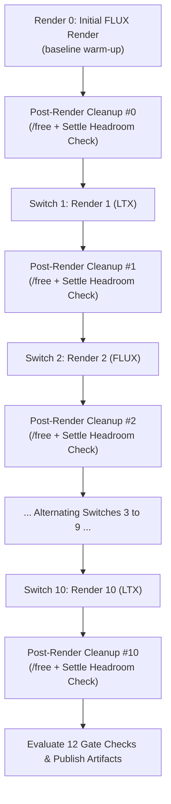
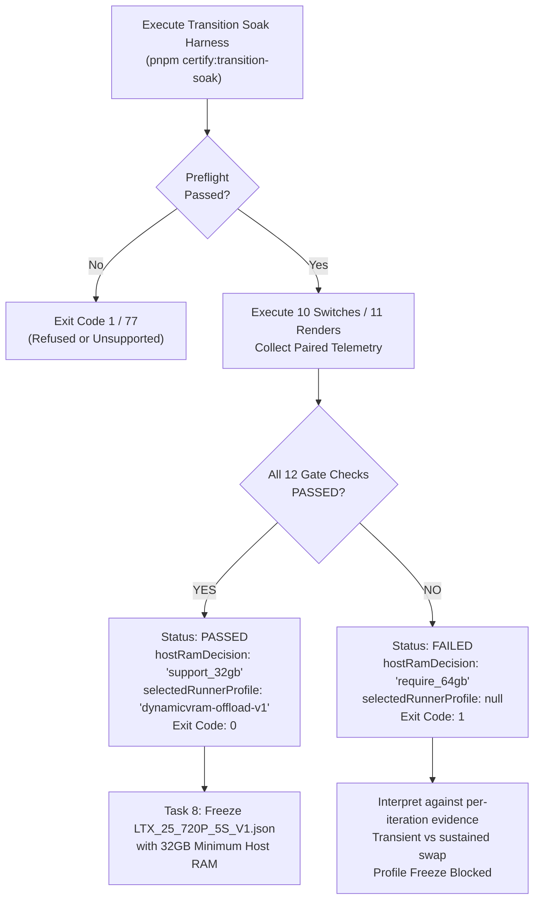

# FLUX ↔ LTX Transition Soak Certification Runbook & Metric Semantics

This document describes the operational procedures, metric semantics, CLI usage, hardware requirements, threshold formulas, and acceptance criteria for certifying alternating FLUX.1 [schnell] and LTX-2.5 generative workloads on the Trinidad NVIDIA GeForce RTX 4090 render host.

---

## 1. Prerequisites & Target Environment

Transition soak certification verifies the empirical stability and memory envelope of the render worker under continuous, interleaved model family transitions (FLUX $\leftrightarrow$ LTX). Certification must be performed directly on the target hardware under controlled conditions.

### Target Hardware & Host Requirements
- **Host Platform:** Linux x86_64 (Linux kernel `/proc` filesystem required for host telemetry: `/proc/meminfo`, `/proc/vmstat`, `/proc/<pid>/status`, `/proc/<pid>/stat`).
- **GPU:** Dedicated NVIDIA GeForce RTX 4090 (24 GB VRAM).
- **GPU Driver & Tools:** Official NVIDIA proprietary driver with CUDA support and `nvidia-smi` available in `$PATH`.
- **Runtime:** Node.js 24 LTS (`Krypton`) and `pnpm` 9.x.
- **ComfyUI Service:** Running ComfyUI instance accessible over HTTP/WebSocket, with its OS process ID (`PID`) known to the operator.
- **Memory Mode:** ComfyUI must run in **DynamicVRAM / workflow-managed offloading** mode (default startup args without explicit `--highvram`, `--gpu-only`, `--lowvram`, `--novram`, `--normalvram`, or `--cpu` flags).
- **Disk Storage:** At least **100 GB** of verified free disk space reservation on the filesystem hosting ComfyUI models and outputs (`minFreeDiskGb: 100`).
- **Approved Gold Master Reports:** Approved, host-validated Gold Master provenance JSON reports for both FLUX and LTX generated from the running Trinidad host (`source.kind = "validated_host_export"` with an immutable Git commit revision and exact workflow/model SHA-256 hashes).
- **Single-Family Baseline Artifacts:** Baseline single-family result artifacts for both FLUX (`certification/flux-schnell/flux-schnell-cert-run-001/result.json`) and LTX (`certification/ltx-25/ltx-cert-run-002/result.json`).

### Idle-Host Operating Requirement
System-wide metrics (`hostRamUsedMb`, `swapUsedDeltaMb`, `systemMajorPageFaultDelta`, `systemSwapInPageDelta`, `systemSwapOutPageDelta`) measure global Linux kernel counters. The render workstation must be **otherwise idle** during the entire soak run. External background processes, browsers, or concurrent jobs will inject noise into system deltas and trigger false gate failures.

---

## 2. Certification CLI Invocation

The transition soak certification harness is executed via the `certify:transition-soak` script in `@cco/render-worker`:

```bash
pnpm certify:transition-soak -- \
  --comfyui-dir "$COMFYUI_DIR" \
  --comfyui-url "$COMFYUI_URL" \
  --comfyui-pid "$COMFYUI_PID" \
  --flux-gold-master-provenance "$FLUX_GOLD_MASTER" \
  --ltx-gold-master-provenance "$LTX_GOLD_MASTER" \
  --run-id trinidad-rtx4090-dynamicvram-v1
```

### CLI Flag Reference

| Flag | Required | Default | Description |
|---|---|---|---|
| `--comfyui-dir <path>` | **Yes** | — | Path to the ComfyUI installation directory. |
| `--comfyui-url <url>` | **Yes** | — | ComfyUI HTTP/WebSocket base URL (e.g. `http://127.0.0.1:8188`). |
| `--comfyui-pid <pid>` | **Yes** | — | Process ID (PID) of the running ComfyUI process (positive integer). |
| `--flux-gold-master-provenance <path>` | **Yes** | — | Path to approved FLUX Gold Master provenance JSON report. |
| `--ltx-gold-master-provenance <path>` | **Yes** | — | Path to approved LTX Gold Master provenance JSON report. |
| `--run-id <id>` | **Yes** | — | Unique run identifier matching `^[a-z0-9][a-z0-9._-]*$`. |
| `--manifest <path>` | No | `templates/provenance.json` | Path to certification profile manifest JSON. |
| `--gpu-index <index>` | No | `0` | Zero-based NVIDIA GPU device index. |
| `--output-root <path>` | No | `certification/transition-soak` | Destination root directory for transition soak evidence. |
| `--transition-count <count>` | No | `10` | Number of family transitions to execute (integer $\ge 10$). |
| `--flux-baseline <path>` | No | `baseline/flux-schnell/result.json` | Path to baseline FLUX single-family artifact JSON. |
| `--ltx-baseline <path>` | No | `certification/ltx-25/ltx-cert-run-002/result.json` | Path to baseline LTX single-family artifact JSON. |
| `--min-post-unload-free-vram-mb <mb>` | No | `23000` | Minimum free VRAM required after model unload (MB). |
| `--min-host-available-mb <mb>` | No | `1024` | Minimum available host system RAM required at all times (MB). |
| `--max-vram-growth-mb <mb>` | No | `256` | Maximum progressive peak VRAM growth allowed (MB). |
| `--max-host-growth-mb <mb>` | No | `256` | Maximum progressive peak host RAM or RSS growth allowed (MB). |
| `--max-latency-degradation-percent <pct>` | No | `20` | Maximum median latency increase permitted vs baseline (%). |
| `--cleanup-timeout-ms <ms>` | No | `30000` | Maximum duration to await post-unload VRAM headroom (ms). |
| `--cleanup-poll-interval-ms <ms>` | No | `500` | Polling interval during post-unload settle (ms). |
| `--highvram` | No | — | Rejected. Transition soak strictly requires DynamicVRAM mode. |
| `--help`, `-h` | No | — | Display CLI usage information and exit. |

### Exit Codes

| Exit Code | Classification | Meaning |
|---|---|---|
| `0` | **Success** | All preflight checks passed, all 10 transitions (11 renders) completed without OOM or unexpected restarts, post-unload settle was verified on every iteration, all 12 gate checks passed, and artifacts were published atomically. |
| `1` | **Failure** | Certification failed. Triggers include: preflight hash mismatch, unpinned/unapproved provenance, memory mode conflict, ComfyUI render error, cleanup headroom timeout, OOM, process crash/restart, telemetry sampling error, counter reset, gate check failure, or filesystem write failure. |
| `77` | **Unsupported Hardware** | Execution environment lacks required hardware (e.g., non-Linux OS, `nvidia-smi` missing/unreachable, non-RTX 4090 GPU, VRAM $< 24$ GB). This allows generic CI environments to intentionally skip live hardware certification without reporting a false test failure. |

---

## 3. Transition Sequence: Ten Switches & Eleven Renders

The harness executes a deterministic alternating sequence of **ten family switches across eleven render iterations**:



### Iteration Structure

| Render Index | Transition Index | From Family | Target Family | Workload Profile | Description |
|:---:|:---:|:---:|:---:|:---:|:---|
| `0` | `null` | `null` | `flux` | `flux-schnell-draft` | Initial baseline render (1024x1024, 1 frame, 4 steps) |
| `1` | `1` | `flux` | `ltx` | `ltx-25-720p-97f` | Transition #1: FLUX $\rightarrow$ LTX (1280x720, 97 frames, 8 steps) |
| `2` | `2` | `ltx` | `flux` | `flux-schnell-draft` | Transition #2: LTX $\rightarrow$ FLUX |
| `3` | `3` | `flux` | `ltx` | `ltx-25-720p-97f` | Transition #3: FLUX $\rightarrow$ LTX |
| `4` | `4` | `ltx` | `flux` | `flux-schnell-draft` | Transition #4: LTX $\rightarrow$ FLUX |
| `5` | `5` | `flux` | `ltx` | `ltx-25-720p-97f` | Transition #5: FLUX $\rightarrow$ LTX |
| `6` | `6` | `ltx` | `flux` | `flux-schnell-draft` | Transition #6: LTX $\rightarrow$ FLUX |
| `7` | `7` | `flux` | `ltx` | `ltx-25-720p-97f` | Transition #7: FLUX $\rightarrow$ LTX |
| `8` | `8` | `ltx` | `flux` | `flux-schnell-draft` | Transition #8: LTX $\rightarrow$ FLUX |
| `9` | `9` | `flux` | `ltx` | `ltx-25-720p-97f` | Transition #9: FLUX $\rightarrow$ LTX |
| `10` | `10` | `ltx` | `flux` | `flux-schnell-draft` | Transition #10: LTX $\rightarrow$ FLUX |
| `11` *(Optional / N+1)* | `11` | `flux` | `ltx` | `ltx-25-720p-97f` | Final transition for symmetrical closure when configured |

*Note: For the standard 10-switch soak (`requestedTransitionCount: 10`), exactly 11 renders (Render 0 through Render 10: 6 FLUX, 5 LTX) are executed. Each transition strictly alternates `fromFamily` $\neq$ `family`.*

### Post-Render Model Offload & Settle Loop
After every render:
1. The harness calls ComfyUI's model unload endpoint (`POST /free` with `{ unload_models: true, free_memory: true }`).
2. The harness actively polls GPU and host telemetry every `500 ms` up to a hard `30,000 ms` deadline.
3. Cleanup passes only when `freeVramMb >= minPostUnloadFreeVramMb` ($23,000\text{ MB}$) is observed.
4. If cleanup times out, the iteration records a cleanup failure and the harness halts further transitions.

### Process Identity Assertion
During every 200 ms sample across all iterations, the harness checks ComfyUI's OS PID and `/proc/<pid>/stat` field 22 (`starttime` in kernel jiffies). If the PID changes or the process was restarted, the run immediately registers an unexpected restart and fails.

---

## 4. Metric Semantics & Threshold Formulas

The harness collects synchronized telemetry every **200 ms** during render execution and active cleanup settling.

### Raw Metric Definitions

| Metric | Source | Unit & Derivation | Semantics |
|---|---|---|---|
| **GPU VRAM (Total/Used/Free)** | `nvidia-smi` | `MB` | Exact integer VRAM values reported by NVIDIA driver. |
| **Driver-Reserved VRAM** | GPU Telemetry | `MB` | `totalVramMb - (usedVramMb + freeVramMb)`. Constant driver reservation. |
| **Allocatable VRAM Pool** | GPU Telemetry | `MB` | `usedVramMb + freeVramMb`. The true denominator for headroom and utilisation. |
| **Peak VRAM** | GPU Telemetry | `MB` | Maximum `usedVramMb` observed across all samples in the run/iteration. |
| **Host RAM (Total/Avail/Used)** | `/proc/meminfo` | `MB` | `hostRamTotalMb = round(MemTotal_kB / 1024)`<br>`hostRamAvailableMb = round(MemAvailable_kB / 1024)`<br>`hostRamUsedMb = hostRamTotalMb - hostRamAvailableMb` |
| **Peak Host Used RAM** | Host Telemetry | `MB` | Maximum `hostRamUsedMb` (`MemTotal - MemAvailable`) observed across samples. |
| **Process RSS (`processRssMb`)** | `/proc/<pid>/status` (`VmRSS`) | `MB` | `round(VmRSS_kB / 1024)`. Resident memory bound strictly to ComfyUI's PID. |
| **Peak Process RSS** | Host Telemetry | `MB` | Maximum `processRssMb` observed across samples. |
| **Swap Used Delta** | `/proc/meminfo` | `MB` | `swapUsedMb(last_sample) - swapUsedMb(first_sample)`. |
| **System Page Fault Deltas** | `/proc/vmstat` | Pages / Faults | `last_sample - first_sample` for `pgmajfault` (major) and `pgfault` (minor). |
| **System Swap Page Deltas** | `/proc/vmstat` | Pages | `last_sample - first_sample` for `pswpin` (swap in) and `pswpout` (swap out). |
| **Process Page Fault Deltas** | `/proc/<pid>/stat` | Faults | `last_sample - first_sample` for field 12 (`majflt`) and field 10 (`minflt`). |
| **Post-Unload Free VRAM** | Settle Sample | `MB` | Free VRAM measured after `/free` and settle polling. |

### Mathematical Threshold Formulas

1. **Same-Family Peak VRAM Growth:**
   $$\Delta \text{PeakVRAM}_{\text{family}} = \text{PeakVRAM}_{\text{last\_iteration}}(\text{family}) - \text{PeakVRAM}_{\text{first\_iteration}}(\text{family}) \le 256\text{ MB}$$
   *Evaluated separately for FLUX and LTX.*

2. **Post-Unload Used VRAM Growth:**
   $$\Delta \text{PostUnloadUsedVRAM} = \text{PostUnloadUsedVRAM}_{\text{last\_iteration}} - \text{PostUnloadUsedVRAM}_{\text{first\_iteration}} \le 256\text{ MB}$$

3. **Same-Family Peak Host RAM & RSS Growth:**
   $$\Delta \text{PeakHostRAM}_{\text{family}} = \text{PeakHostRAM}_{\text{last\_iteration}}(\text{family}) - \text{PeakHostRAM}_{\text{first\_iteration}}(\text{family}) \le 256\text{ MB}$$
   $$\Delta \text{PeakRSS}_{\text{family}} = \text{PeakRSS}_{\text{last\_iteration}}(\text{family}) - \text{PeakRSS}_{\text{first\_iteration}}(\text{family}) \le 256\text{ MB}$$
   *Evaluated separately for FLUX and LTX.*

4. **Post-Unload Host RAM & RSS Growth:**
   $$\Delta \text{PostUnloadHostRAM} = \text{PostUnloadHostRAM}_{\text{last\_iteration}} - \text{PostUnloadHostRAM}_{\text{first\_iteration}} \le 256\text{ MB}$$
   $$\Delta \text{PostUnloadRSS} = \text{PostUnloadRSS}_{\text{last\_iteration}} - \text{PostUnloadRSS}_{\text{first\_iteration}} \le 256\text{ MB}$$

5. **Median Latency Degradation vs Single-Family Baselines:**
   $$\text{Degradation}_{\text{family}} = \frac{\text{median}(\text{Durations}_{\text{family}}) - \text{BaselineDuration}_{\text{family}}}{\text{BaselineDuration}_{\text{family}}} \times 100 \le +20.0\%$$
   *Evaluated separately for FLUX and LTX against their respective single-family baseline durations.*

6. **Host Available RAM Headroom:**
   $$\text{hostRamAvailableMb} \ge 1,024\text{ MB} \quad \text{across every sample in every iteration}$$

7. **Sustained Swap Activity Policy (Decay and Recurrence):**
   Swap activity across $N$ soak iterations is evaluated by partitioning iterations into a first half ($0 \le i < \lceil N/2 \rceil$) and a second half ($\lceil N/2 \rceil \le i < N$). For an odd number of iterations, the middle iteration is grouped into the first half.

   - **Independent Metric Series:** Decay is evaluated independently for each of the three swap telemetry metrics: `swapUsedDeltaMb`, `systemSwapInPageDelta`, and `systemSwapOutPageDelta`.
   - **Second-Half Decay Rule:** A metric series has decayed if its second-half sum is strictly less than 10% of its first-half sum or strictly below its noise floor:
     $$\sum_{\text{second}} \text{Metric} < 0.10 \times \sum_{\text{first}} \text{Metric} \quad \lor \quad \sum_{\text{second}} \text{Metric} < \text{NoiseFloor}$$
     - `swapUsedDeltaMb` noise floor: $10\text{ MB}$
     - `systemSwapInPageDelta` noise floor: $2,500\text{ pages}$
     - `systemSwapOutPageDelta` noise floor: $2,500\text{ pages}$
   - **Recurrence Rule:** An iteration has significant swap if `swapUsedDeltaMb > 5 MB`, `systemSwapInPageDelta > 1,250 pages`, or `systemSwapOutPageDelta > 1,250 pages`. Significant swap is recurrent when observed in strictly more than half of all iterations:
     $$N_{\text{significant}} > \frac{N}{2}$$
   - **Classification Outcomes:**
     - `None` (`None (PASS)`): No positive delta observed across any swap metric in any iteration.
     - `Transient` (`Transient (PASS)`): Swap activity is observed, all three metric series decay in the second half, and significant swap is not recurrent.
     - `Sustained` (`Sustained (FAIL)`): Swap activity is observed and at least one metric series fails to decay or significant swap is recurrent.
   - **Evidence Preservation & Null Handling:** Null metric values (`null`) remain raw evidence in artifacts and summaries, and contribute zero only to classification arithmetic.

---

## 5. The 12 Gate Checks & Decision Tree

### Resource Gate Checks Matrix

| # | Gate Check Name | Pass Condition | Description |
|:---:|:---|:---|:---|
| 1 | `completedRequiredTransitions` | `completedTransitionCount >= 10 && iterations.length == 11` | Executed initial render plus 10 completed family switches. |
| 2 | `allRendersSuccessful` | `renderFailureCount === 0` | Every render succeeded with non-null execution ID and total duration. |
| 3 | `allCleanupsSuccessful` | `cleanupFailureCount === 0` | Every post-render model unload passed within timeout with non-null VRAM. |
| 4 | `noOom` | `oomCount === 0` | Zero CUDA or host Out-Of-Memory errors detected. |
| 5 | `noUnexpectedRestarts` | `unexpectedRestartCount === 0` | Zero ComfyUI process restarts or PID/starttime changes. |
| 6 | `noSamplingErrors` | `samplingErrorCount === 0` | All 200 ms telemetry intervals collected without sampling errors. |
| 7 | `noSwapActivity` | `classification !== "sustained"` | Tolerates none (`None (PASS)`) and transient (`Transient (PASS)`) swap; fails only on sustained (`Sustained (FAIL)`) swap. |
| 8 | `postUnloadVramHeadroomMet` | `postUnloadFreeVramMb >= 23000` | Free VRAM after unload $\ge 23,000\text{ MB}$ across every iteration. |
| 9 | `hostMemoryHeadroomMet` | `hostRamAvailableMb >= 1024` | Host available RAM $\ge 1,024\text{ MB}$ across all samples. |
| 10 | `vramGrowthWithinTolerance` | Growth $\le 256\text{ MB}$ | Same-family and post-unload VRAM growth $\le 256\text{ MB}$. |
| 11 | `hostGrowthWithinTolerance` | Growth $\le 256\text{ MB}$ | Same-family and post-unload Host RAM and RSS growth $\le 256\text{ MB}$. |
| 12 | `latencyWithinTolerance` | Degradation $\le +20\%$ | Median duration degradation $\le 20\%$ vs single-family baselines. |

### Pass / Fail Decision Tree



#### Passing Outcome: `support_32gb`
- **Criteria:** All 12 gate checks evaluate to `true` (including `noSwapActivity`, which passes when classified as `None` or `Transient`).
- **Artifact Values:** `status = "passed"`, `hostRamDecision = "support_32gb"`, `selectedRunnerProfile = "dynamicvram-offload-v1"`, `failure = null`.
- **Production Result:** The 32 GB workstation is stable under multi-model interleaved load. Authorizes freezing the production `RenderProfile` for the certified engine.

#### Failing Outcome: `require_64gb`
- **Criteria:** Any of the 12 gate checks evaluates to `false` (e.g. sustained swap activity detected, memory leak $> 256\text{ MB}$, OOM, latency degradation $> 20\%$).
- **Artifact Values:** `status = "failed"`, `hostRamDecision = "require_64gb"`, `selectedRunnerProfile = null`, with a structured `failure` object.
- **Production Result:** `require_64gb` records that at least one gate check failed (such as sustained swap thrashing or memory exhaustion). The Markdown summary explicitly displays the classification as `None (PASS)`, `Transient (PASS)`, or `Sustained (FAIL)`. The profile freeze is blocked because #8 conditions it on a passing soak.
- **Historical Interpretation:** Under the prior zero-tolerance check, run `trinidad-rtx4090-dynamicvram-v1` returned `require_64gb` due to transient swap confined to the first four transitions while all other 11 checks passed. Under the sustained-swap classification policy, the recorded Trinidad values re-evaluate as transient swap and `support_32gb` without altering the historical certification artifact.

---

## 6. Cited Single-Family Baselines (Comparison Inputs Only)

The table below records the empirical physical resource envelope measured during prior single-family baseline runs on the Trinidad RTX 4090 host.

> [!IMPORTANT]
> **These baseline values are cited comparison inputs, not transition conclusions.**
>
> They provide the baseline render durations and reference peak memory metrics for latency degradation and growth evaluations. They do not substitute for or predict the outcome of the live 10-switch soak test.

| Metric Property | FLUX.1 [schnell] Baseline (`flux-schnell-draft`) | LTX-2.5 720p Baseline (`ltx-25-720p-97f`) |
|---|---|---|
| **Source Artifact** | `baseline/flux-schnell/summary.md` | `certification/ltx-25/ltx-cert-run-002/summary.md` |
| **ComfyUI Commit** | `55b6a9b11dffecdd65a3ccd5eb6a1b3a178c96dc` | `55b6a9b11dffecdd65a3ccd5eb6a1b3a178c96dc` |
| **Workflow SHA-256** | `af8528239790f6536ce7f0733f92095501fecfd8e919084a9decdded59e6ecf5` | `94f397eee3ad8b0cee000036119e524e8c7a012b88d79d00b74172df9d9bf539` |
| **Baseline Total Render Duration** | **11,020 ms** (11.02 s) | **46,874 ms** (46.87 s) |
| **Peak VRAM** | 23,938 MB (99.5% allocatable) | 23,618 MB (98.2% allocatable) |
| **Peak Host RAM Used** | **29,087 MB** | **29,325 MB** (93.9% of host RAM) |
| **Peak Process RSS** | 26,874 MB | 26,732 MB |
| **Measured Swap Activity** | **0 MB (0 in / 0 out)** | **0 MB (0 in / 0 out)** |
| **Post-Unload Free VRAM** | 23,487 MB | 23,451 MB |
| **Driver-Reserved VRAM** | 513 MB | 513 MB |
| **Allocatable VRAM Denominator** | 24,051 MB (Nameplate: 24,564 MB) | 24,051 MB (Nameplate: 24,564 MB) |

---

## 7. Output Layout & Video Media Rule

Upon completion of a soak run, evidence artifacts are written atomically into a dedicated run directory:

```text
certification/transition-soak/<run-id>/
├── result.json   # Machine-readable JSON artifact (validated against TransitionSoakArtifactSchema)
└── summary.md   # Human-readable Markdown summary report
```

### Video & Image Media Storage Rule
- Large rendered video and image binary outputs (e.g. `.mp4`, `.png`) **remain external** on the render workstation filesystem or object storage.
- The certification artifact records output object keys, file paths, and hashes under `render.outputs`.
- **Rendered binary media files must never be committed to Git.**
